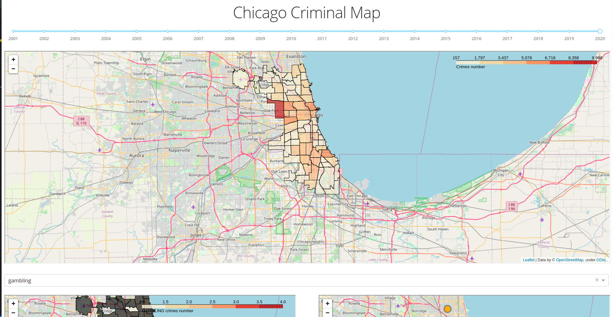
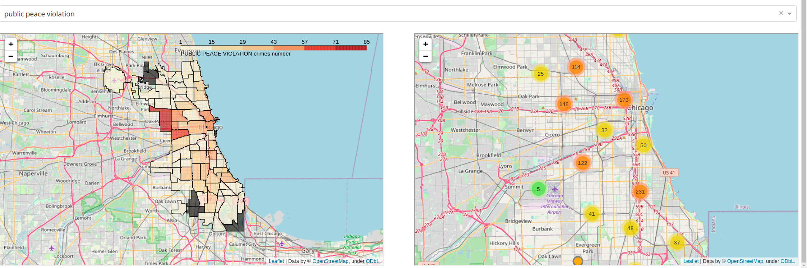

# Chicago Criminal Map project

Chicago Criminal map web-app:





## How to run

Clone repo:

```shell
git clone https://github.com/ArtamonovDen/HSE-Small-PySpark-Project.git
cd HSE-Small-PySpark-Project
mkdir maps
mkdir maps/criminal_heatmaps
mkdir maps/special_crime_heatmaps
mkdir maps/special_crime_markers
```

Maps will be cached inside ./maps

Download [data](https://data.cityofchicago.org/Public-Safety/Crimes-2001-to-Present/ijzp-q8t2) and [geojson](https://data.cityofchicago.org/Facilities-Geographic-Boundaries/Boundaries-Community-Areas-current-/cauq-8yn6)

App is based on [jupyter/pyspark-notebook](https://hub.docker.com/r/jupyter/pyspark-notebook). So pull it:

```shell
docker pull jupyter/pyspark-notebook
```

Run container and **export** PYTHON_PATH env var. It allows app to find Pyspark module:

```shell
docker run -d --name chicagoMap -p 8888:8888 -v <path to /HSE-Small-PySpark-Project>:/home/jovyan/work jupyter/pyspark-notebook
```

**Note**, that jupyter from container is available now. So, you can check `bigdata.ipynb`.

Go inside container:

```shell
docker exec -it chicagoMap
cd work
```

Last steps:

```shell
pip install -r requirements.txt
export PYTHONPATH=/usr/local/spark/python/lib/py4j-0.10.9-src.zip:/usr/local/spark/python:
```

Run it!

```shell
python app.py
```

I know, we should you docker-compose for that. Will be done later
